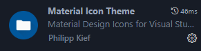
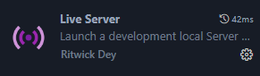
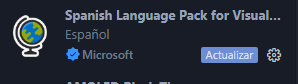
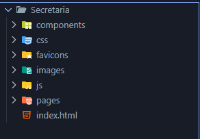
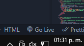
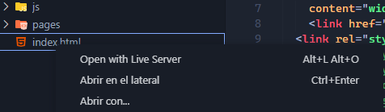
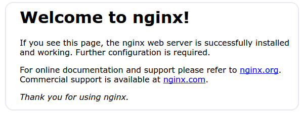

# Guía Paso a Paso: Crear y Publicar una Página Web Sencilla

🧩 Este documento te guiará paso a paso para crear y publicar una página web sencilla en un servidor propio, ya sea en tu ordenador o en un servicio en la nube como AWS. ¡No necesitas experiencia previa!

---

## Paso 1: Preparar tu Ordenador

### 1.1 Requisitos Básicos
- **Un ordenador con conexión a Internet**. (Esto es para que trabajes tu, osea tu equipo personal)
- **Un editor de texto** (como [Visual Studio Code](https://code.visualstudio.com/) ya que es a mi consideracion el mejor para desarrollo web).
- **Acceso a un servidor** (puede ser tu propio ordenador o un servicio en la nube como AWS).

### 1.2 Crear una Carpeta para tu Proyecto
1. Abre tu ordenador y crea una carpeta nueva en el escritorio o en cualquier lugar fácil de encontrar.
2. Nombra la carpeta, por ejemplo: `miPaginaWeb`.

#### Si tienes poca experiencia usando VS code (Visual Studio Code) te dejo lo siguiente: 

En una parte de la instalacion Marquen la opción "add 'open with code' action..." así pueden abrir carpetas enteras desde los archivos

[INSTALAR Y CONFIGURAR VISUAL STUDIO CODE EN WINDOWS](https://youtu.be/X_Z7d04x9-E)

##### Extensiones de Visual Studio
Yo te recomiendo instalar las siguientes extensiones  en visual Studio para que puedas trabajar mas a gusto:

 

Revisa para que sirve cada una al momento de instalarlas y como usarlas, es sencillo

---

## Paso 2: Crear una Página Web Sencilla

### 2.1 Crear el Archivo HTML
1. Abre tu editor de texto.
2. Crea un nuevo archivo y guárdalo como `index.html` dentro de la carpeta `miPaginaWeb`.
3. Escribe el siguiente código HTML:

    ```html
    <!DOCTYPE html>
    <html lang="es">
    <head>
        <meta charset="UTF-8">
        <title>Mi Primera Página</title>
    </head>
    <body>
        <h1>¡Hola, Mundo!</h1>
        <p>Esta es mi primera página web.</p>
    </body>
    </html>
    ```

4. Guarda el archivo.

O bien puedes descargar una plantilla [Theme wagon HTML5 & CSS3](https://themewagon.com/) para que tengas una referencia de la estructura de una pagina estatica 

### Recomendacion de estructura de carpetas

No hay una manera especifica para acomodar tus archivos (a no ser que uses un framework), lo recomendable es ordenarlas lo mas limpio posible por si el proyecto crece

```
📁miPaginaWeb/
│
├── 📁css/          # Carpeta para archivos CSS
│ └── styles.css    # Archivo principal de estilos
├── 📁js/           # Carpeta para archivos JavaScript
│ └── main.js       # Archivo principal de scripts
├── 📁images/       # Carpeta para imágenes
│ └── logo.png      # Ejemplo de imagen
├── 📁assets/       # Carpeta para otros recursos (fuentes, iconos, etc.)
│ └── fonts/        # Subcarpeta para fuentes personalizadas
├── index.html      # Archivo principal de la página (página de inicio)
└── README.md       # Documentación del proyecto (opcional)
```

##### Usa la que mas te acomode, estas son las que uso para paginas estaticas


```
📁 miPaginaWeb/
│
│── 📁 assets/            # Recursos estáticos
│   ├── 📁 images/        # Imágenes
│   ├── 📁 css/           # Archivos CSS
│   │   ├── styles.css    # Estilos principales
│   ├── 📁 js/            # Archivos JavaScript
│   │   ├── scripts.js    # Funciones principales
│── 📁 pages/             # Páginas HTML adicionales
│   ├── about.html        # Página "Acerca de"
│   ├── contact.html      # Página de contacto
│── index.html            # Página principal
│── README.md             # Documentación del proyecto

```

**Página estática:** Su contenido es fijo y no cambia a menos que se edite el código HTML manualmente. Ejemplo: una página informativa con solo HTML y CSS.

**Página dinámica:** Su contenido cambia según la interacción del usuario o datos del servidor, usando tecnologías como JavaScript, PHP o bases de datos. Ejemplo: una tienda en línea con productos actualizables.

### 2.2 Ver tu Página en el Navegador
(Aun no visible en linea para los demas)

##### De manera normal

1. Abre la carpeta `miPaginaWeb`.
2. Haz doble clic en el archivo `index.html`.
3. ¡Verás tu página web en el navegador!

##### Extension de Visual Studio

1.    Abre un proyecto en donde tengas tu index.html (o la pagina que quieras ver) y haz clic en "Go Live" en la barra de estado para encender/apagar el servidor. Go Live Control Preview.

 

2. O haz clic derecho en un archivo HTML desde la ventana del explorador y selecciona "Open with Live Server". 



Prepara tu pagina para tenerla lista y solamente subirla

En Chrome te recomiendo instalar esta extension para ver la responsividad mas facil


Aunque nada es mejor que aprender a usar la herramienta de desarrollador de los navegadores, te recomiendo meterle mano a eso con algun tutorial

---

## Paso 3: Acceder a un Servidor

### 3.1 Guía para Configurar tu Primer Servidor Web Local

Si quieres usar tu propio ordenador como servidor para alojar y ver tu primera página web, sigue estos pasos. Esta guía está diseñada para personas sin experiencia previa.

---

#### 1. **¿Qué es un servidor web?**
Un servidor web es un programa que permite que tu ordenador "sirva" páginas web. Cuando visitas una página en internet, estás accediendo a un servidor web en algún lugar del mundo. En este caso, usaremos tu ordenador como servidor para ver tu página web localmente (solo en tu ordenador).

---

#### 2. **Instalar un servidor web: Apache o XAMPP**
Hay varias opciones para instalar un servidor web, pero las más comunes para principiantes son **Apache** o **XAMPP**.

- **Apache**: Un servidor web popular, pero requiere más configuración manual.
- **XAMPP**: Un paquete que incluye Apache, MySQL, PHP y más. Es más fácil de usar para principiantes.

##### **Instalar XAMPP (recomendado para principiantes)**

1. **Descarga XAMPP**:
   - Ve a la página oficial de XAMPP: [https://www.apachefriends.org/es/index.html](https://www.apachefriends.org/es/index.html).
   - Descarga la versión adecuada para tu sistema operativo (Windows, macOS, Linux).

2. **Instala XAMPP**:
   - Ejecuta el instalador que descargaste.
   - Sigue las instrucciones en pantalla. Asegúrate de seleccionar **Apache** (y **MySQL** si planeas usar bases de datos).

3. **Inicia Apache**:
   - Abre el **Panel de Control de XAMPP**.
   - Haz clic en **"Start"** junto a **Apache** para iniciar el servidor web.
   - Si todo va bien, el texto junto a Apache se pondrá en verde.

---

#### 3. **Colocar los archivos de tu página web en la carpeta del servidor**
Una vez que el servidor esté funcionando, coloca los archivos de tu página web en la carpeta correcta.

1. **Encuentra la carpeta del servidor**:
   - Si usas XAMPP, la carpeta se llama **htdocs**. Está en:
     - Windows: `C:\xampp\htdocs`
     - macOS: `/Applications/XAMPP/htdocs`
     - Linux: `/opt/lampp/htdocs`

2. **Crea tu archivo HTML**:
   - Con tu pagina html que creamos anteriormente  la vamos a mover a la ruta en donde generalmente las aplicaciones de servidor web las jalan automaticamente:
   Guarda/copia los archivo/s en donde esta tu `index.html` dentro de la carpeta **`C:\xampp\htdocs`**. (todos, incluido el index.html)

---

#### 4. **Ver tu página web en el navegador**
Ahora que tienes tu archivo `index.html` en la carpeta `htdocs`, puedes ver tu página web.

1. **Abre tu navegador** (Chrome, Firefox, Edge, etc.).
2. **Escribe en la barra de direcciones**: `http://localhost`
   - `localhost` es una dirección especial que apunta a tu propio ordenador.
3. **Presiona Enter**:
   - Si todo está bien, verás tu página web

3. **En todo caso de que quieras cargar varias paginas en tu computadora**:

- En la carpeta `htdocs` ubicada en Windows: `C:\xampp\htdocs`, vas a crear las carpetas que necesites y en el navegador vas a escribir la ruta de tu archivo, por ejemplo:  
```
📁htdocs/
│
├── 📁pagina1/          
│ └── index.html  
├── 📁miprimerapaginafinal/           
│ └── index.php       
├── 📁pagina3/       
│ └── holamundo3.html  
```
Para cargar cada pagina 
   http://localhost/pagina1/index.html
   http://localhost/miprimerapaginafinal/index.php 
   http://localhost/pagina3/holamundo3.html

---

#### 5. **Acceder desde otro dispositivo en tu red local**
Si quieres que otros dispositivos en **tu red local** (como tu teléfono o tablet) vean tu página, sigue estos pasos:

1. **Encuentra tu dirección IP local**:
   - En Windows: Abre la línea de comandos (cmd) y escribe `ipconfig`. Busca la dirección IPv4 (por ejemplo, `192.168.1.100`).
   - En macOS o Linux: Abre la terminal y escribe `ifconfig`. Busca la dirección IP.

2. **Accede desde otro dispositivo**:
   - En el navegador del otro dispositivo, escribe `http://[tu-dirección-IP]`. Por ejemplo, `http://192.168.1.100`.
   - Si todo está bien, verás tu página web.

---

#### 6. **¿Y si quieres que tu página sea accesible desde internet?**
Para que tu página sea accesible desde cualquier lugar del mundo, necesitarías:
- Configurar tu router para permitir el tráfico entrante (esto se llama "abrir puertos").
**Se los puedo explicar en una clase por aparte**
- Usar una dirección IP pública o un servicio como **ngrok** para exponer tu servidor local a internet.

**Nota**: Esto es más avanzado y requiere conocimientos adicionales de redes y seguridad.

Tener en consideracion que si van a montar definitivamente una pagina desde una empresa o su casa en un "Servidor" o maquina como su pc, necesitas (no forzosamente) una IP fija o un DDNS (Servicio que revisa cual es su ip dinamica de manera constante), ademas necesitan hacer port forwarding dependiendo de su red y abrir los puertos en su Modem, puerto 80 http y 443 si tienen certificados web (Se configuran cuando montas el servidor web)

---

¡Y eso es todo! Ahora tienes tu propio servidor web local funcionando y has creado tu primera página web. ¡Sigue aprendiendo y experimentando!

### 3.2 Opción 2: Usar un Servidor en la Nube (AWS)
Si prefieres usar un servidor en la nube:
1. Crea una cuenta en [AWS](https://aws.amazon.com/).
2. Sigue los pasos para crear una instancia EC2 (un servidor virtual).
3. Conéctate a tu servidor usando SSH y sube tus archivos (`index.html`).
4. Visita la dirección IP de tu servidor en el navegador para ver tu página.

---

#### [Cómo instalar Nginx en Ubuntu 20.04](https://aws.amazon.com/)


# Cómo Instalar Nginx en Ubuntu 20.04

## Introducción
Nginx es uno de los servidores web más populares del mundo y aloja algunos de los sitios más grandes y con mayor tráfico en Internet. Es una opción ligera que se puede utilizar como servidor web o proxy inverso.

En esta guía, explicaremos cómo instalar Nginx en su servidor de Ubuntu 20.04, adaptar el firewall, administrar el proceso de Nginx y configurar bloques de servidor para alojar más de un dominio desde un solo servidor.

## Requisitos previos
Antes de comenzar a aplicar esta guía, debe tener un non-root user normal con privilegios sudo configurado en su servidor. Para obtener información sobre cómo configurar una cuenta de usuario regular consulte nuestra [Guía de configuración inicial del servidor para Ubuntu 20.04](https://www.digitalocean.com/community/tutorials/initial-server-setup-with-ubuntu-20-04).

Cuando disponga de una cuenta, inicie sesión como non-root user para comenzar.

## Paso 1: Instalar Nginx
Debido a que Nginx está disponible en los repositorios predeterminados de Ubuntu, es posible instalarlo desde estos repositorios usando el sistema de paquetes `apt`.

Ya que esta es nuestra primera interacción con el sistema de paquetes `apt` en esta sesión, actualizaremos nuestro índice local de paquetes de modo que tengamos acceso a los listados de paquetes más recientes. A continuación, podremos instalar `nginx`:

```bash
sudo apt update
sudo apt install nginx
```

Tras aceptar el procedimiento, `apt` instalará Nginx y cualquier dependencia necesaria en su servidor.

## Paso 2: Aplicar ajustes al firewall
Antes de probar Nginx, se deben aplicar ajustes al software del firewall para permitir el acceso al servicio. Nginx se registra de forma automática como un servicio con `ufw` tras la instalación, lo que hace que sea sencillo permitir el acceso de Nginx.

Enumere las configuraciones de la aplicación con las que `ufw` sabe trabajar escribiendo lo siguiente:

```bash
sudo ufw app list
```

Debería obtener un listado de los perfiles de aplicación:

```
Output
Available applications:
  Nginx Full
  Nginx HTTP
  Nginx HTTPS
  OpenSSH
```

Como se muestra en el resultado, hay tres perfiles disponibles para Nginx:

- **Nginx Full**: este perfil abre el puerto 80 (tráfico web normal, no cifrado) y el puerto 443 (tráfico TLS/SSL cifrado).
- **Nginx HTTP**: este perfil abre solo el puerto 80 (tráfico web normal, no cifrado).
- **Nginx HTTPS**: este perfil abre solo el puerto 443 (tráfico TLS/SSL cifrado).

Se recomienda habilitar el perfil más restrictivo, que de todos modos permitirá el tráfico que configuró. En este momento, solo tendremos que permitir el tráfico en el puerto 80.

Puede habilitarlo escribiendo lo siguiente:

```bash
sudo ufw allow 'Nginx HTTP'
```

Puede verificar el cambio escribiendo lo siguiente:

```bash
sudo ufw status
```

El resultado indicará el tráfico de HTTP que se permite:

```
Output
Status: active

To                         Action      From
--                         ------      ----
OpenSSH                    ALLOW       Anywhere                  
Nginx HTTP                 ALLOW       Anywhere                  
OpenSSH (v6)               ALLOW       Anywhere (v6)             
Nginx HTTP (v6)            ALLOW       Anywhere (v6)
```

## Paso 3: Comprobar su servidor web
Al final del proceso de instalación, Ubuntu 20.04 inicia Nginx. El servidor web ya debería estar activo.

Realice una verificación con `systemd init` para asegurarse de que el servicio esté en ejecución escribiendo lo siguiente:

```bash
systemctl status nginx
```

```
Output
● nginx.service - A high performance web server and a reverse proxy server
   Loaded: loaded (/lib/systemd/system/nginx.service; enabled; vendor preset: enabled)
   Active: active (running) since Fri 2020-04-20 16:08:19 UTC; 3 days ago
     Docs: man:nginx(8)
 Main PID: 2369 (nginx)
    Tasks: 2 (limit: 1153)
   Memory: 3.5M
   CGroup: /system.slice/nginx.service
           ├─2369 nginx: master process /usr/sbin/nginx -g daemon on; master_process on;
           └─2380 nginx: worker process
```

Como lo confirma este resultado, el servicio se inició correctamente. Sin embargo, la mejor forma de comprobarlo es solicitar una página de Nginx.

Puede acceder a la página de aterrizaje predeterminada de Nginx para confirmar que el software funcione correctamente dirigiéndose a la dirección IP de su servidor. Si no conoce la dirección IP de su servidor, puede buscarla con la herramienta `icanhazip.com`, que le proporcionará su dirección IP pública tal como la recibió de otra ubicación en Internet:

```bash
curl -4 icanhazip.com
```

Cuando tenga la dirección IP de su servidor, introdúzcala en la barra de direcciones de su navegador:

```
http://your_server_ip
```

Debería obtener como resultado la página de destino de Nginx:



Si está en esta página, su servidor se está ejecutando correctamente y está listo para ser administrado.

## Paso 4: Administrar el proceso de Nginx
Ahora que su servidor web está listo, revisaremos algunos de los comandos básicos de administración.

Para detener su servidor web, escriba lo siguiente:

```bash
sudo systemctl stop nginx
```

Para iniciar el servidor web cuando no esté activo, escriba lo siguiente:

```bash
sudo systemctl start nginx
```

Para detener y luego iniciar el servicio de nuevo, escriba lo siguiente:

```bash
sudo systemctl restart nginx
```

Si solo está realizando cambios en la configuración, Nginx a menudo puede volver a cargase sin perder las conexiones. Para hacer esto, escriba lo siguiente:

```bash
sudo systemctl reload nginx
```

De forma predeterminada, Nginx está configurado para iniciarse automáticamente cuando lo haga el servidor. Si no es lo que quiere, deshabilite este comportamiento escribiendo lo siguiente:

```bash
sudo systemctl disable nginx
```

Para volver a habilitar el servicio de modo que se cargue en el inicio, puede escribir lo siguiente:

```bash
sudo systemctl enable nginx
```

Ya aprendió los comandos de administración básicos y debería estar listo para configurar el sitio para alojar más de un dominio.

## Paso 5: Configurar bloques de servidor (recomendado)
Al emplear el servidor web Nginx, se pueden utilizar bloques de servidor (similares a hosts virtuales de Apache) para encapsular los detalles de la configuración y alojar más de un dominio desde un único servidor. Configuraremos un dominio llamado `your_domain`, pero debería cambiarlo por su propio nombre de dominio. 

**Para obtener más información sobre cómo configurar un nombre de dominio es ptra clase que pueden pedirme**

Nginx en Ubuntu 20.04 tiene habilitado un bloque de servidor por defecto, que está configurado para suministrar documentos desde un directorio en `/var/www/html`. Si bien esto funciona bien para un solo sitio, puede ser difícil de manejar si aloja varios. En vez de modificar `/var/www/html`, vamos a crear una estructura de directorios dentro de `/var/www` para nuestro sitio `your_domain` y dejaremos `/var/www/html` como directorio predeterminado que se suministrará si una solicitud de cliente no coincide con otros sitios.

Cree el directorio para `your_domain` como se muestra a continuación, usando el indicador `-p` para crear cualquier directorio principal necesario:

```bash
sudo mkdir -p /var/www/your_domain/html
```

A continuación, asigne la propiedad del directorio con la variable de entorno `$USER`:

```bash
sudo chown -R $USER:$USER /var/www/your_domain/html
```

Los permisos de los roots web deberían ser correctos si no modificó el valor `umask`, que establece permisos de archivos predeterminados. Para asegurarse de que sus permisos sean correctos y permitir al propietario leer, escribir y ejecutar los archivos, y a la vez conceder solo permisos de lectura y ejecución a los grupos y terceros, puede ingresar el siguiente comando:

```bash
sudo chmod -R 755 /var/www/your_domain
```

A continuación, cree una página de ejemplo `index.html` utilizando `nano` o su editor favorito:

```bash
nano /var/www/your_domain/html/index.html
```

Dentro de ella, agregue el siguiente ejemplo de HTML:

```html
<html>
    <head>
        <title>Welcome to your_domain!</title>
    </head>
    <body>
        <h1>Success!  The your_domain server block is working!</h1>
    </body>
</html>
```

Cuando termine, escriba `CTRL` y `X`, y luego, `Y` y `ENTER`, para guardar y cerrar el archivo.

Para que Nginx presente este contenido, es necesario crear un bloque de servidor con las directivas correctas. En vez de modificar el archivo de configuración predeterminado directamente, crearemos uno nuevo en `/etc/nginx/sites-available/your_domain`:

```bash
sudo nano /etc/nginx/sites-available/your_domain
```

Péguelo en el siguiente bloque de configuración, similar al predeterminado, pero actualizado para nuestro nuevo directorio y nombre de dominio:

```nginx
server {
        listen 80;
        listen [::]:80;

        root /var/www/your_domain/html;
        index index.html index.htm index.nginx-debian.html;

        server_name your_domain www.your_domain;

        location / {
                try_files $uri $uri/ =404;
        }
}
```

Observe que actualizamos la configuración `root` en nuestro nuevo directorio y el `server_name` para nuestro nombre de dominio.

A continuación, habilitaremos el archivo creando un enlace entre él y el directorio `sites-enabled`, en el cual Nginx obtiene lecturas durante el inicio:

```bash
sudo ln -s /etc/nginx/sites-available/your_domain /etc/nginx/sites-enabled/
```

Ahora, contamos con dos bloques de servidor habilitados y configurados para responder a las solicitudes conforme a las directivas `listen` y `server_name` (puede obtener más información sobre cómo Nginx procesa estas directivas [aquí](https://www.digitalocean.com/community/tutorials/understanding-nginx-server-and-location-block-selection-algorithms)):

- **your_domain**: responderá a las solicitudes de `your_domain` y `www.your_domain`.
- **default**: responderá a cualquier solicitud en el puerto 80 que no coincida con los otros dos bloques.

Para evitar un problema de memoria de depósito de hash que pueda surgir al agregar nombres de servidor, es necesario aplicar ajustes a un valor en el archivo `/etc/nginx/nginx.conf`. Abra el archivo:

```bash
sudo nano /etc/nginx/nginx.conf
```

Encuentre la directiva `server_names_hash_bucket_size` y borre el símbolo `#` para eliminar el comentario de la línea. Si utiliza `nano`, presione `CTRL` y `w` para buscar rápidamente palabras en el archivo.

```nginx
...
http {
    ...
    server_names_hash_bucket_size 64;
    ...
}
...
```

Guarde y cierre el archivo cuando termine.

A continuación, compruebe que no haya errores de sintaxis en ninguno de sus archivos de Nginx:

```bash
sudo nginx -t
```

Si no hay problemas, reinicie Nginx para habilitar los cambios:

```bash
sudo systemctl restart nginx
```

Con esto, Nginx debería proporcionar su nombre de dominio. Puede probarlo visitando `http://your_domain`, donde debería ver algo como esto:


## Paso 6: Familiarizarse con archivos y directorios importantes de Nginx
Ahora que sabe administrar el propio servicio de Nginx, debería tomarse unos minutos para familiarizarse con algunos directorios y archivos importantes.

### Contenido
- **/var/www/html**: el contenido web real, que por defecto solo consta de la página predeterminada de Nginx que vio antes, se presenta desde el directorio `/var/www/html`. Esto se puede cambiar modificando los archivos de configuración de Nginx.

### Configuración del servidor
- **/etc/nginx**: directorio de configuración de Nginx. En él se encuentran todos los archivos de configuración de Nginx.
- **/etc/nginx/nginx.conf**: archivo de configuración principal de Nginx. Esto se puede modificar para realizar cambios en la configuración general de Nginx.
- **/etc/nginx/sites-available/**: directorio en el que se pueden guardar bloques de servidor por sitio. Nginx no utilizará los archivos de configuración de este directorio a menos que estén vinculados al directorio `sites-enabled`. Normalmente, toda la configuración del bloque de servidor se realiza en este directorio y luego se habilita estableciendo un vínculo con el otro directorio.
- **/etc/nginx/sites-enabled/**: directorio en el que se almacenan los bloques de servidor habilitados por sitio. Normalmente, estos se crean estableciendo vínculos con los archivos de configuración del directorio `sites-available`.
- **/etc/nginx/snippets**: este directorio contiene fragmentos de configuración que pueden incluirse en otras partes de la configuración de Nginx. Los segmentos de configuración potencialmente repetibles reúnen las condiciones para la conversión a fragmentos.

### Registros del servidor
- **/var/log/nginx/access.log**: cada solicitud a su servidor web se registra en este archivo de registro, a menos que Nginx esté configurado para hacer algo diferente.
- **/var/log/nginx/error.log**: cualquier error de Nginx se asentará en este registro.

## Conclusión
Una vez instalado su servidor web, tiene muchas opciones respecto del tipo de contenido que ofrecerá y de las tecnologías que desee usar para crear una experiencia más completa.


```

¡Listo! Ahora tienes una página web sencilla y has aprendido cómo publicarla en un servidor. En los siguientes pasos, podrás personalizarla y hacerla más avanzada.
